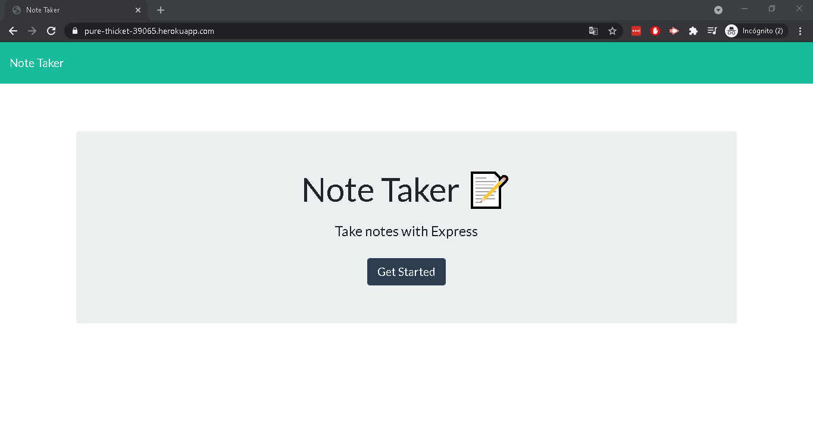
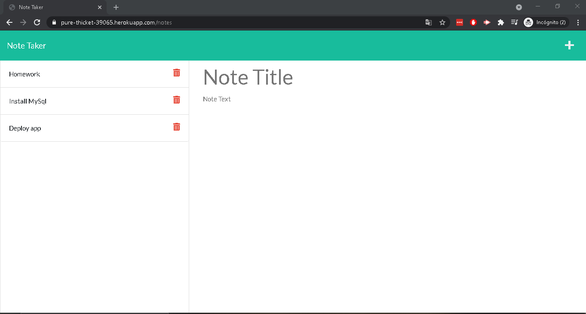

[License: MIT](https://opensource.org/licenses/MIT)

## Table of Contents
  
[Title](#Title)  
[Description](#Description)  
[Installation](#Installation)  
[Usage](#Usage)  
[Contribution](#Contribution)  
[Test](#Test)  
[Questions](#Questions)    
[License](#License)    
# Title
Note Taker

# Description
Application called Note Taker that can be used to write and save notes. This application uses an Express.js back end and saves and retrieves note data from a JSON file.

# Installation
"npm start" for running the application.

# Usage
After the Note Taker app is open, it is presented a landing page with a link to a notes page, once it is clicked on the link to the notes page, it is presented a page with existing notes listed in the left-hand column, plus empty fields to enter a new note title and the note’s text in the right-hand column. When it is enter a new note title and the note’s text, then a Save icon appears in the navigation at the top of the page. When it is clicked on the Save icon, the new note entered is saved and appears in the left-hand column with the other existing notes. Also when it is clicked on an existing note in the list in the left-hand column then that note appears in the right-hand column. Clicking on the Write icon in the navigation at the top of the page, empty fields are presented to enter a new note title and the note’s text in the right-hand column.

# Contribution
It is necessary to know the basics of expressjs(routing), fs, JSON, node packages. You can contribute reporting bugs, suggesting enhacements, pull requests. Best practices for class/id naming conventions, indentation, quality comments, etc.

# Test
For local testing use: "git clone git@github.com:jorgeatcabo/note-taker.git" and “npm install”. For testing on a deployment URL use: https://pure-thicket-39065.herokuapp.com/

# Questions
https://github.com/jorgeatcabo

san_lucas2005@yahoo.com

# License
MIT

# Screenshots

